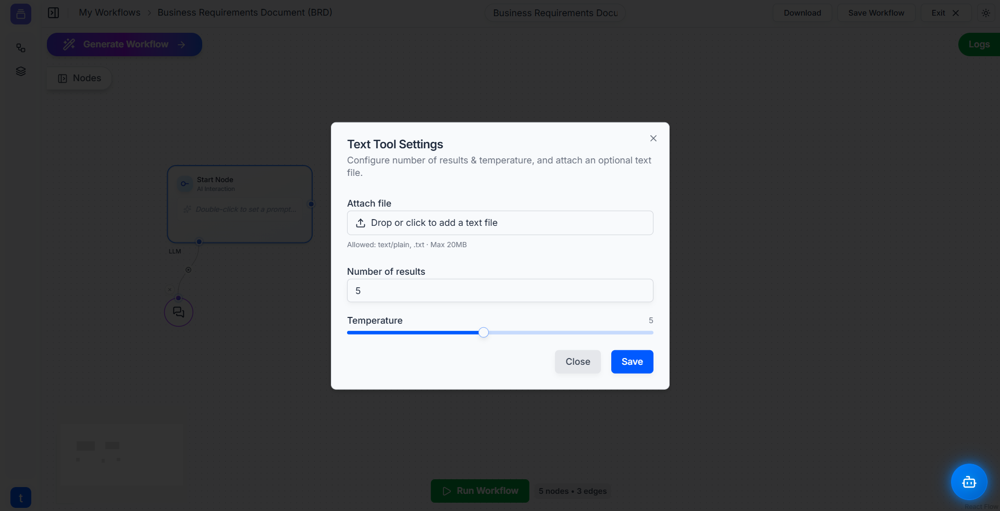

# Tool: Text Tool 📄

The **Text Tool** is your primary way to work with blocks of text. You can use it to load text from a file or directly input text to be used by other nodes in your workflow.

Its most common and powerful use is to provide a knowledge base or context for an **[Ai Agent](ai_agent.md)** to read and analyze, acting as the agent's short-term memory for a specific task.

---

### **How It Works**

The Text Tool is configured to hold a piece of text and then passes that text to the next node in the workflow.

#### Key Settings

When you double-click a Text Tool node, you will see the following settings:

* **Attach file:** This is the main feature. You can drag and drop a `.txt` file (up to 20MB) to load its content directly into your workflow. This is perfect for feeding articles, reports, logs, or any other text document to an agent.
* **Number of results:** For text analysis tasks, this field allows you to specify how many results you want. For example, you might ask an agent to find the "top 5" key points from the attached text.
* **Temperature:** This slider adjusts the focus of the text analysis.
    * **Lower values** lead to more precise, literal, and predictable results.
    * **Higher values** allow for more abstract or creative interpretations of the text.

---

### **Setting Up Your Text Tool**

1.  **Add the Tool:** Find the **Text Tool** in the **Tools** panel and drag it onto your workflow canvas.
    
    

2.  **Configure It:** Double-click the Text Tool node to open its settings. The most common action is to drag and drop your `.txt` file into the **Attach file** area.

3.  **Adjust (Optional):** Set the **Number of results** or **Temperature** if your task requires specific analysis parameters.

4.  **Save and Connect:** Click "Save" and then connect the output of the Text Tool to the input of another node. Most often, this will be the `Tool` input socket on an **Ai Agent**.

---

### **Example in Action: Providing Context to an Ai Agent 💡**

This is the most common use case for the Text Tool. Let's say you want an Ai Agent to answer questions about a specific project brief that is saved in a `.txt` file.

1.  **Load the Brief:** Configure a **Text Tool** by attaching your `project_brief.txt` file.
2.  **Ask a Question:** Use a **[Start Node](../utils/start.md)** to input your question, such as: *"Based on the brief, what are the top three project deliverables?"*
3.  **Connect to the Agent:**
    * Connect the **Text Tool** to the `Tool` input socket of an **Ai Agent**. This gives the agent the "skill" to read the brief.
    * Connect the **Start Node** to the main input of the **Ai Agent**. This provides your question.
4.  **Instruct the Agent:** The Ai Agent will now use the content from the Text Tool as the primary source of truth to answer the question you provided in the Start Node.

---

### **Quick Tips**

* **Primary Knowledge Source:** Think of the Text Tool as the best way to give an Ai Agent a document to read for a task.
* **Check File Type and Size:** Ensure your file is plain text (`.txt`) and under the 20MB size limit.
* **Simple Input:** For many workflows, you'll only need to use the "Attach file" feature. The other settings are for more advanced use cases.