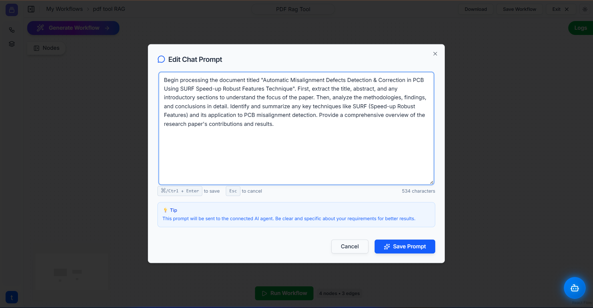
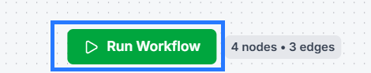
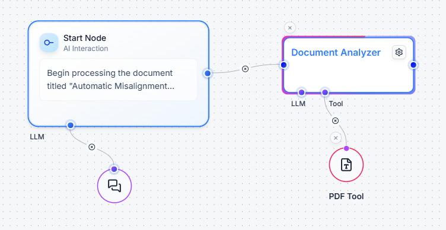
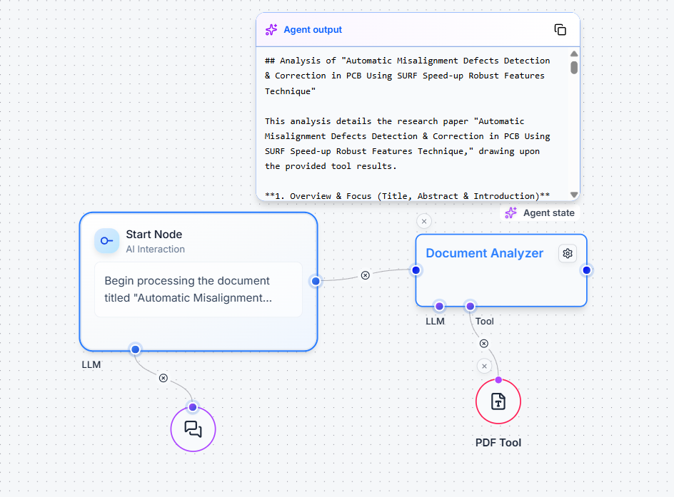
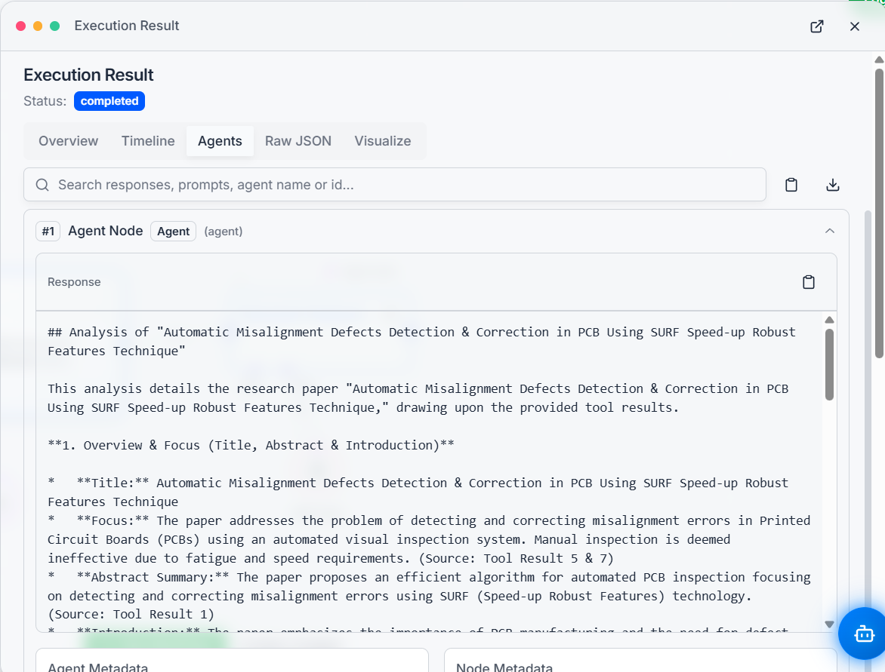

# Use Case Guide: Building a Document Q&A Workflow (RAG)

This guide will walk you through building a complete workflow that lets you "chat" with your documents. The system will read a document you provide, and then you can ask it questions. The AI will find the answers within your document and give you a summary.

This powerful technique is often called **Retrieval-Augmented Generation (RAG)**, as the AI *retrieves* information before it *generates* an answer.

### **Components We'll Use**

* **[Start Node](../utils/start.md):** To ask our question.
* **[LLM](../utils/llm.md):** To provide the "brain" for our agent.
* **[PDF Tool](../tools/text.md):** To load and read our document. (You can substitute a [Text Tool](text.md) for `.txt` files).
* **[Ai Agent](../utils/ai_agent.md):** To manage the task of reading the document and answering our question.

---

### **Step 1: Set Up the Basic Workflow Structure**

First, let's build the skeleton of our workflow on the canvas.

1.  **Add the Nodes:** From the Tool Palette, drag a **Start Node**, an **LLM** util, a **PDF Tool**, and an **Ai Agent** util onto your canvas.
2.  **Set the Global LLM:** Connect the **LLM** node to the `LLM` input socket on the **Start Node**. This sets the default "brain" for our entire workflow. Configure your desired model within the LLM node.
3.  **Connect the Agent:** Connect the main output of the **Start Node** to the main input of the **Ai Agent**.
4.  **Connect the Tool:** Connect the output of the **PDF Tool** to the `Tool` input socket on the **Ai Agent**. This gives the agent the "skill" to read PDF files.

Your initial setup should look like this:

---

### **Step 2: Configure the Tools**

Now, let's give our nodes their specific instructions.

1.  **Configure the PDF Tool:** Double-click the **PDF Tool** and attach the document you want to ask questions about. Click **Save**.
2.  **Configure the Start Node:** Double-click the **Start Node** and enter your main instruction or question. This prompt tells the agent what to do with the document. For example:
    > *"Analyze the attached research paper and provide a summary covering its main objective, methodology, and key findings."*

    

3.  **Name Your Agent (Optional):** You can double-click the title of the **Ai Agent** node and give it a descriptive name, like "Document Analyzer".

---

### **Step 3: Run the Workflow and Check the Results**

With everything configured, it's time to run the automation and see the results.

1.  **Run the Workflow:** Click the green **"Run Workflow"** button.

    

    You will see the workflow execute step-by-step. The Start Node will pass the instruction to the Ai Agent, which will then use the PDF Tool to read the document's contents.

    

2.  **View the Agent's Live State:** As the agent works, you can hover over it to see the **"Agent state"**. This shows you the live output as it's being generated.

    

3.  **Check the Final Logs:** Once the workflow status is "completed," the best place to see the full, detailed answer is in the logs.
    * Click the **"Logs"** button in the top-right corner.
    * In the **Execution Result** panel, you will see the final, formatted response from your "Document Analyzer" agent.

    

You have now successfully built a powerful RAG workflow that can read a document and provide intelligent answers based on its content!