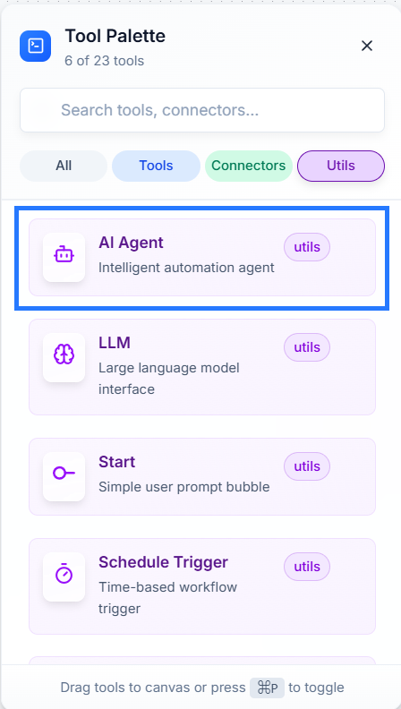

# Util: Ai Agent 🧠

The **Ai Agent** is your smart orchestrator for automation. Think of it as the project manager or "brain" of a task. You give it instructions, and it uses an LLM for intelligence and other **Tools** for specific skills (like reading files or searching the web) to get the job done.

---

### **How It Works**

The Ai Agent works by combining three key components: an LLM, optional Tools, and your specific instructions.

1.  **Providing LLM Intelligence (Required):** Every Ai Agent needs a "language engine" to think. This can be provided in two ways:
    * **Global LLM (Recommended):** Connect an **LLM** util to your workflow's **Start** node. This sets a default LLM for all Ai Agents, simplifying your setup.
    * **Specific LLM (To Override):** Connect an **LLM** util directly to an Ai Agent's `LLM` input socket. Use this **only** if you need a specific agent to use a different model or settings than the global one.
    > *For more details on global configuration, please refer to the [**Start** node documentation](start.md).*

2.  **Tool Connections (Optional):** You can give your agent special skills by connecting one or more `Tools` to the `Tool` input socket. For example, connecting a **Web Tool** allows the agent to search the internet, while connecting a **File Read Tool** lets it read documents.

3.  **Your Instructions (Configuration):** You configure the agent's specific task using these settings:

    

    * **User Message:** Your core command or question for the agent.
    * **System Prompt (Optional):** Sets the agent's personality or role.
    * **Response Format (Optional):** Forces the agent's answer into a specific structure (like `{"category": "..."}`) for consistent, reliable output.

---

### **Viewing the Output**

After a workflow runs successfully, the response and any data generated by the Ai Agent can be viewed in the **Logs** panel. This is the best way to check the agent's results and troubleshoot your workflow.

---

### **Setting Up Your Ai Agent**

1.  **Add the Agent:** Find the **Ai Agent** in the **Utils** panel and drag it onto your workflow canvas.

    

2.  **Ensure an LLM is Provided:** Make sure your workflow has an LLM available, either connected globally to the **Start** node or connected directly to this agent if you need to override the global setting.

3.  **Connect Tools (Optional):** To give your agent specific abilities, add `Tools` to the canvas and connect them to the `Tool` input socket on the **Ai Agent**.

4.  **Provide Data:** Connect your data source (like another node or connector) to the main input of the agent.

5.  **Configure & Save:** Click the Ai Agent node to set the **User Message** and other details, then click **Save Configuration**.

---

### **Example in Action: Question Answering from a Document 💡**

Imagine you have a long PDF report and want to ask specific questions about it without reading the whole thing. This workflow lets the agent read the document and find the answers for you.

*First, ensure your workflow has an LLM configured (either globally at the **Start** node or connected directly to this agent).*

1.  **Provide the Document:** Use a **File Read Tool** to load your document (e.g., a PDF or `.txt` file). This makes the document's content available to the workflow.
2.  **Ask a Question:** Use a **Start** node to input your question. For example: "What were the key findings in the Q3 financial summary?"
3.  **Connect to the Agent:**
    * Connect the **File Read Tool** to the `Tool` input socket on the **Ai Agent**. This gives the agent the "skill" to read your document.
    * Connect the **Start** node to the main input of the **Ai Agent**. This gives the agent your question.
4.  **Instruct the Agent:** In the Ai Agent's settings, set the **User Message** to something like: *"Using the provided document as context, please answer the user's question."*

When you run the workflow, the Ai Agent will use the File Read Tool to access the document's content, find the relevant information related to your question, and generate a concise answer. You can see the final answer in the **Logs** panel.

---

### **Quick Tips**

* **Be Specific:** Clear, detailed instructions give you the best results.
* **Use Response Format for Consistency:** If another node depends on the agent's output, use `Response Format` to prevent errors.
* **No Memory:** The agent handles one task at a time and doesn't remember past runs. Ensure you provide all necessary information in the input each time.