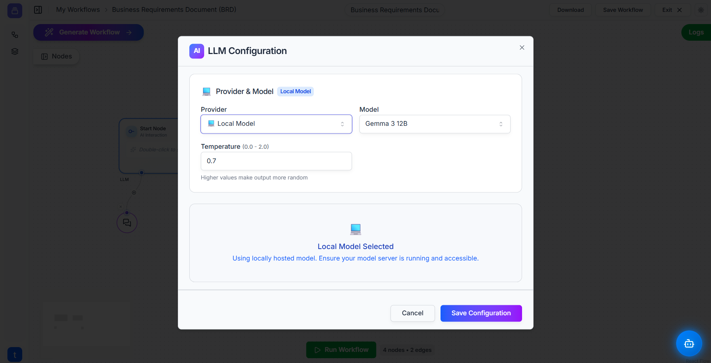
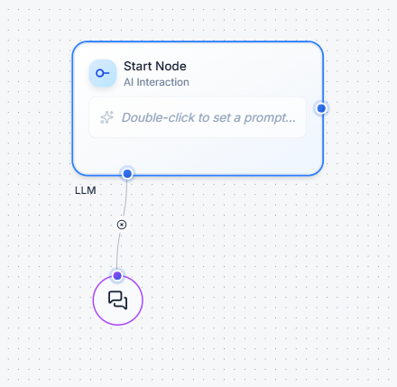

# Util: LLM 🧠

The **LLM (Large Language Model)** util is the actual "engine" or AI brain that performs tasks. While an Ai Agent acts as a project manager that can use tools, the LLM is the specialized expert it consults for thinking, reasoning, and generating text.

You use this node to select exactly which AI model you want your agents to use, whether it's from providers like Google and OpenAI, or a model running on your own computer.

---

### **How It Works**

The primary purpose of the LLM util is to be configured and then connected to another node's `LLM` input socket. It doesn't process data on its own; it provides the *intelligence* for other nodes to use.

#### Key Settings

When you double-click an LLM node, you will see the following configuration options:

* **Provider:** This is where you choose the source of the AI model. This could be a major provider like **Google Gemini** or **OpenAI**, or you can select **Local Model** to use an AI model hosted on your own server.
* **Model:** After selecting a provider, this dropdown lets you choose the specific model you want to use (e.g., `Gemma 3 12B`, `gpt-4o`, etc.). Different models have different strengths.
* **Temperature (Optional):** This setting controls the creativity of the AI's responses. Think of it like a slider:
    * **Low Temperature (e.g., 0.2):** This makes the AI focused and predictable. It's best for factual answers, summarization, and data extraction.
    * **High Temperature (e.g., 0.9):** This makes the AI more creative, random, and imaginative. It's great for brainstorming, writing marketing copy, or creating character dialogues.

---

### **Setting Up Your LLM Node**

1.  **Add the Node:** Find the **LLM** util in the **Utils** panel and drag it onto your workflow canvas.
    
    

2.  **Configure It:** Double-click the LLM node to open its settings. Choose your desired **Provider** and **Model**, and optionally adjust the **Temperature**. Click "Save Configuration".

3.  **Connect It:** Connect the output of the LLM node to the `LLM` input socket of either:
    * A **[Start Node](start.md)** to set a default "global" LLM for the entire workflow.
    * An **[Ai Agent Node](ai_agent.md)** to give that specific agent a different LLM, overriding the global one.

---

### **Example in Action: Global vs. Specific LLM 💡**

Imagine a workflow where you need predictable summaries but also creative social media posts. You can use two different LLMs to handle this.

1.  **Set the Global LLM:** Configure an `LLM` node with a reliable, factual model (e.g., `Google Gemini` with `Temperature: 0.2`). Connect it to the **Start Node**. This will be the default for all general tasks.

2.  **Set the Specific LLM:** Configure a *second* `LLM` node with a highly creative model (e.g., `OpenAI's GPT-4o` with `Temperature: 0.9`). Connect this one directly to the `LLM` input of an **Ai Agent** whose job is to write marketing tweets.

In this setup, any agent in the workflow will use the factual Gemini model by default. However, the marketing agent will **ignore the global setting** and use its own specially-configured creative model for its task.

---

### **Quick Tips**

* **Start with a Global LLM:** For most workflows, connecting a single LLM to your **Start Node** is the simplest and most effective approach.
* **Note on Local Models:** If you select the "Local Model" provider, you are responsible for running and managing that model on your own server. This is an advanced option that requires technical setup outside of this platform.
* **Match the Model to the Task:** Don't use a highly creative model for a task that requires precision. Choose the right provider, model, and temperature for the job you need done.