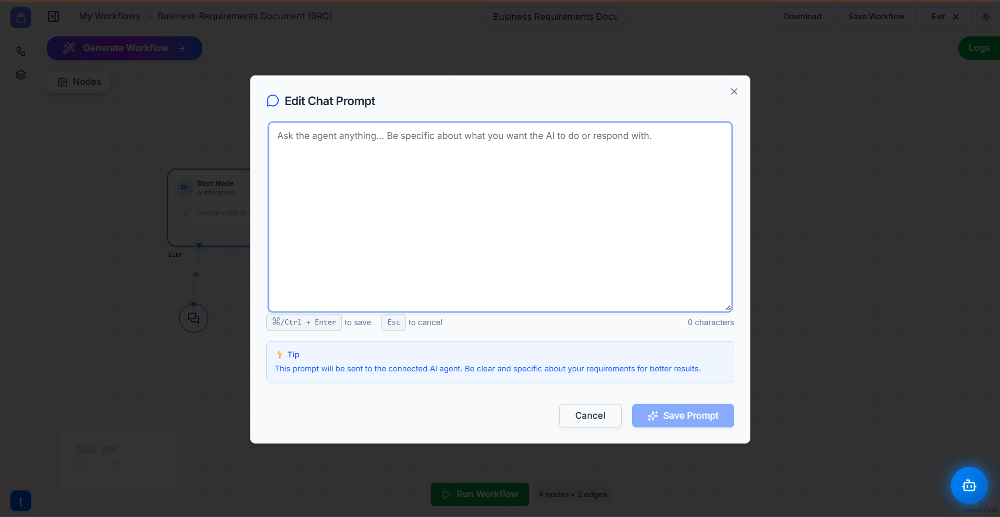
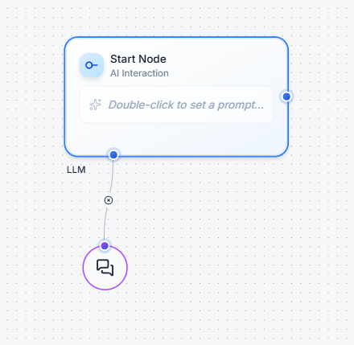
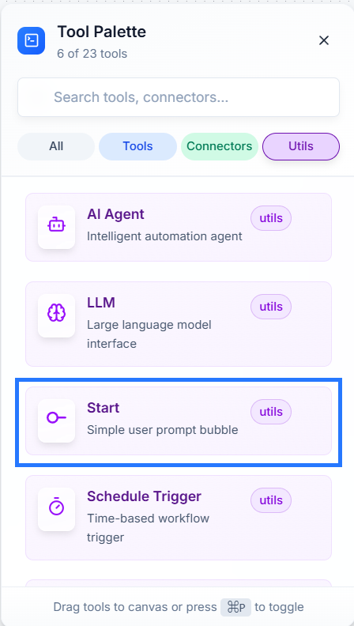
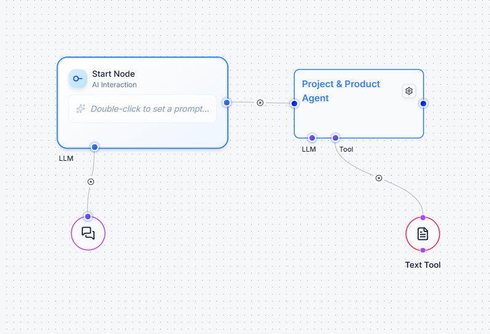

# Util: Start Node ▶️

The **Start Node** is the official beginning of your workflow. It's the primary place where you input your initial question, instruction, or prompt to kick off an automation, especially for tasks involving AI.

Beyond just starting a workflow, it has a crucial special function: you can connect an **LLM** to it to set a **global "brain"** for all the Ai Agents in your project.

---

### **How It Works**

The Start Node has two main functions: capturing your prompt and setting a default LLM.

#### 1. The User Prompt

When you double-click the node, a prompt editor opens. This is where you type the main instruction for your workflow. This text output is then passed to the next node in the chain.

#### 2. The Global LLM Connection

The Start Node has a special `LLM` input socket. When you connect an **LLM** util to this socket, that LLM becomes the default for every **Ai Agent** in your entire workflow. This saves you from having to connect an LLM to each agent individually.

---

### **Setting Up Your Start Node**

1.  **Add the Node:** Find the **Start** util in the **Utils** panel and drag it onto your workflow canvas. Every new workflow typically begins with one.
    
    

2.  **Set the Global LLM (Recommended):** Drag an **LLM** util onto the canvas and connect its output to the `LLM` input socket on the **Start Node**.

3.  **Enter Your Prompt:** Double-click the main body of the **Start Node** to open the "Edit Chat Prompt" window. Type your question or command here and click "Save Prompt".

4.  **Connect the Next Step:** Drag a connection from the main output of the Start Node to the input of the next node, such as an **Ai Agent**.

---

### **Example in Action: A Simple Agent Workflow 💡**

Let's build a basic workflow that uses a Start Node to ask a question and an Ai Agent to answer it.

1.  **Set the Global Brain:** Connect an **LLM** node to the `LLM` input on the **Start Node**.
2.  **Ask a Question:** Double-click the **Start Node** and enter your prompt, for example: *"Explain what a Retrieval-Augmented Generation (RAG) system is in simple terms."*
3.  **Connect the Agent:** Connect the main output of the **Start Node** to an **Ai Agent** node.
4.  **Run the Workflow:** Click **"Run Workflow"**. The prompt from the Start Node will be sent to the Ai Agent, which will use the global LLM to generate an answer. You can view the result in the **Logs** panel.

---

### **Quick Tips**

* **Always Set a Global LLM:** It's a best practice to connect your primary LLM to the Start Node. This keeps your workflows clean and easy to manage.
* **Be Specific:** The prompt you write in the Start Node is the most important input for your entire workflow. Be as clear and detailed as possible to get the best results.
* **One "Start" Per Workflow:** A workflow can only have one starting point. The Start Node is the designated beginning for all interactive, prompt-based automations.